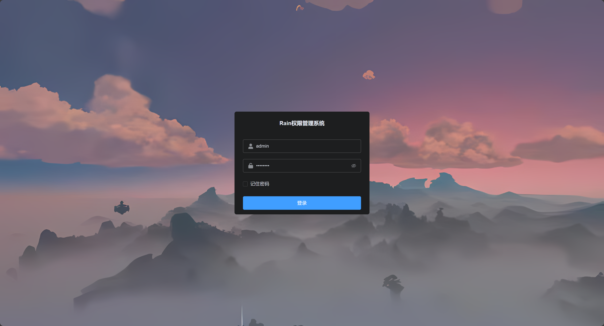
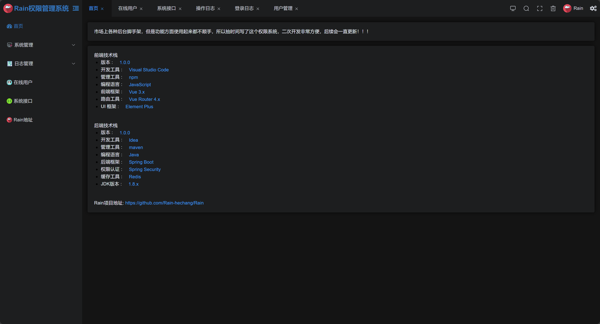
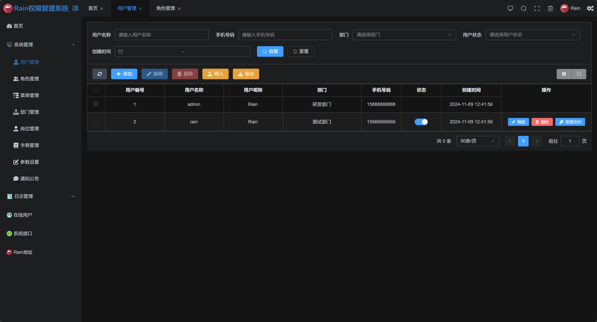
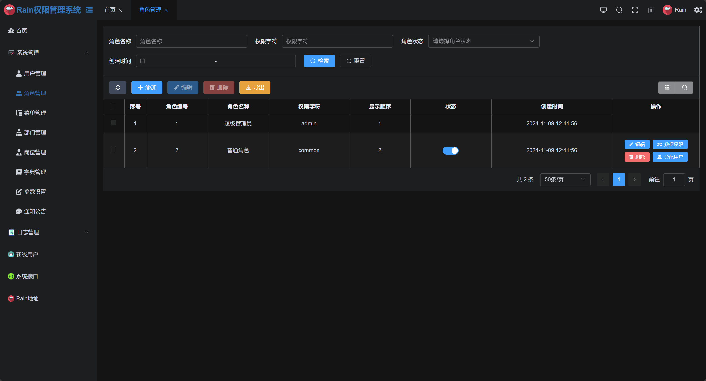
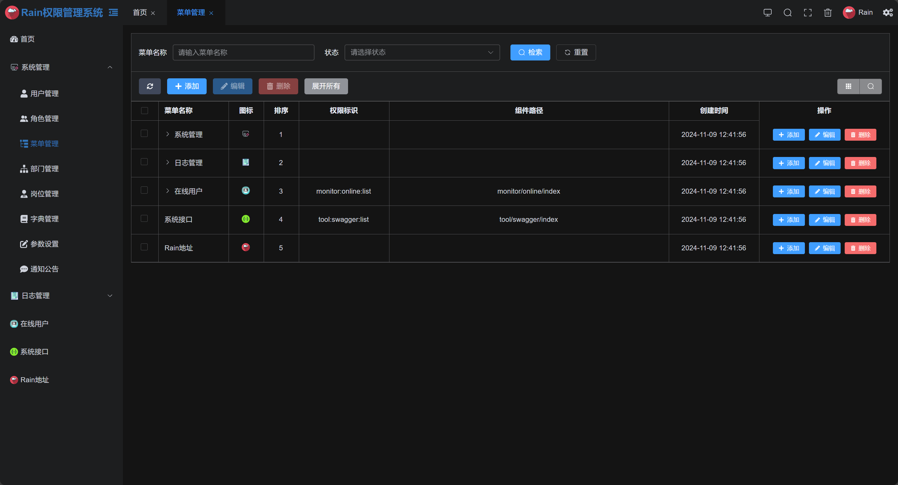
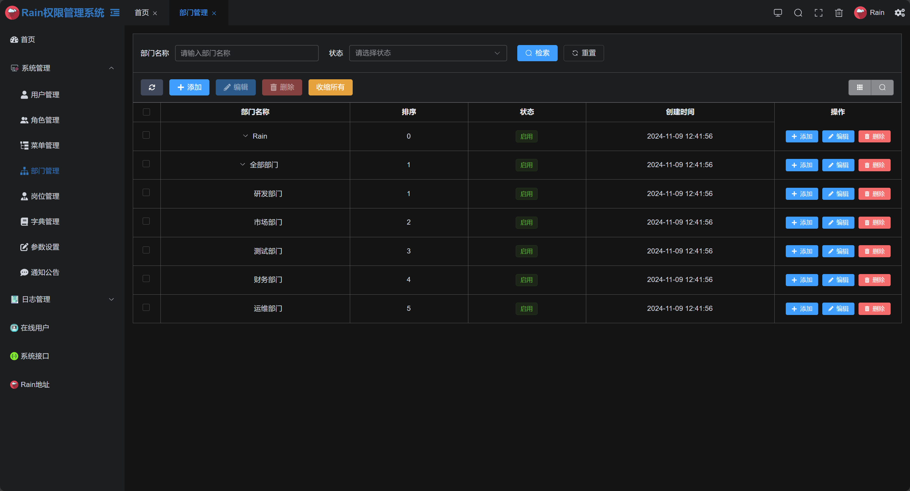
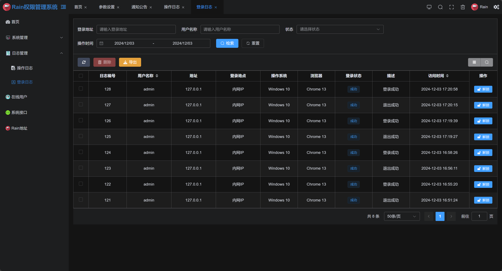
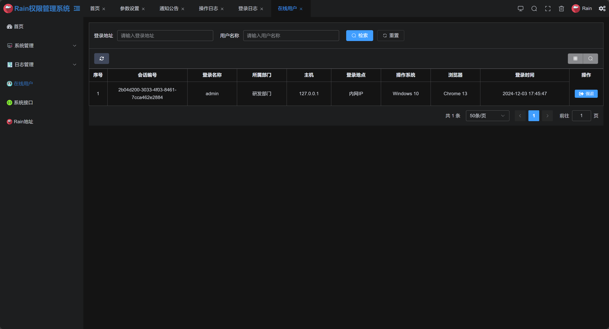

## 简介

* 前端采用Vue3.x、Element UI。
* 后端采用Spring Boot、Spring Security、Redis & Jwt。

## 内置功能

1.  系统管理：
    1. 用户管理：该功能主要完成系统用户配置。
    2. 角色管理：角色菜单权限分配、设置角色按机构进行数据范围权限划分。
    3. 菜单管理：配置系统菜单，操作权限，按钮权限标识等。
    4. 部门管理：配置系统组织机构，树结构展现支持数据权限。
    5. 岗位管理：配置系统用户所属担任职务。
    6. 字典管理：对系统中经常使用的一些较为固定的数据进行维护。
    7. 参数管理：对系统动态配置常用参数。 
    8. 通知公告：系统通知公告信息发布维护。
2.  日志管理：
    1. 操作日志：系统正常操作日志记录和查询；系统异常信息日志记录和查询。
    2. 登录日志：系统登录日志记录查询包含登录异常。
3.  在线用户：当前系统中活跃用户状态监控。
4.  接口文档：根据业务代码自动生成相关的api接口文档。 
5.  Rain项目地址

## 前端运行

```bash
# 进入项目目录
cd rain-ui-vue

# 安装依赖
npm i

# 启动服务
npm run dev

# 打包项目
npm build:prod

```

## 后端运行

# 进入application-druid.yml修改为自己数据库信息
# 进入RainApplication.class启动

## 演示图

<table>
  <tr>
    <td></td>
  </tr>
  <tr>
    <td></td>
  </tr>
  <tr>
    <td></td>
  </tr>
  <tr>
    <td></td>
  </tr>
  <tr>
    <td></td>
  </tr>
  <tr>
    <td></td>
  </tr>
  <tr>
    <td></td>
  </tr>
  <tr>
    <td></td>
  </tr>
</table>